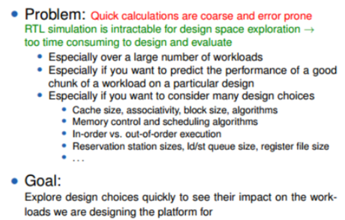
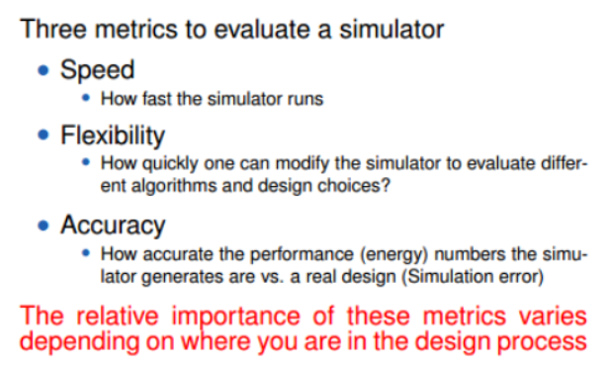

# gem5
gem5的简单上手教程 / Garnet入门与进阶

## Introduction
- a modular discrete event driven computer system simulator platform
- gem5’s components can be rearranged, parameterized, extended or replaced easily
- primarily in C++ and python
- designed for use in computer architecture research

入门资料: 官方documentation

### WHY Simulator




## a simple tul for run gem5
### Build gem5
compile gem5 separately for every ISA that you want to simulate

使用Scons编译gem5, Scons根据`SConstruct`文件来进行编译. 通过命令行可以指定编译参数，比如示例中为:

```python
python3 `which scons` build/X86/gem5.opt -j9
```

编译完成后会得到一个gem5的可执行文件`build/X86/gem5.opt`

gem5 binary types：
- `debug`: debug symbols, no optimization, slow
- `opt`: most optimization, debug symbols, faster
- `fast`: all optimization, no debug symbols, fastest and much smaller

### Configure gem5
set up a configuration script to model a system 

编译gem5得到的binary文件以一个python脚本为参数，来构建系统，为系统模块指定参数和运行simulation

### SimObjects
gem5的模块化设计是通过SimObject类型实现的，大多数组件都是SimObjects: CPUs, caches, memory controllers, buses等等

gem5 exports all of these objects from their C++ implementation to python

基于此，就能够使用python脚本实现SimObject的创建，参数设置和模块交互，基本步骤如下:

1. import the `m5` library and all SimObjects compiled
2. 例化system设置时钟域，时钟频率和电压域
3. 配置存储器(大小、时序), 创建CPU，总线，cache，I/O
4. 设置仿真运行的客户程序与仿真process
5. 例化system与simulation并执行
6. 在命令行运行simulation: 如`build/X86/gem5.opt configs/tutorial/part1/simple.py`

### gem5 ports
gem5使用了端口抽象(封装)，每个memory对象都有两种类型的端口: `request ports`和`response ports`, 在连接时将request port连接到response port(利用等号赋值的方式连接，与顺序无关)

### full system vs syscall emulation
gem5 有两种运行模式: `syscall emulation(SE)`and`full system(FS)`modes
- FS: 仿真(emulate)整个硬件系统并且运行一个未修改过的内核，类似运行虚拟机
- SE: 主要关注CPU和memory系统，仿真Linux系统调用，只能建模user-mode代码

### baseCPUs
gem5 提供的CPU以`{ISA}{Type}CPU`的方式命名. 例如, 一个RISCV Minor CPU为RiscvMinorCPU
- Valid ISAs: Riscv, Arm, X86, Sparc, Power, Mips
- Valid CPU types: AtomicSimpleCPU, O3CPU, TimingSimpleCPu, KvmCPU, MinorCPU

### Add cache to the configuration script
gem5有两套完全不同的子系统来对系统的cache进行建模，取决于是否修改cache coherence protocal/cache coherence protocal对系统性能影响, 作者画了个饼以后会将两者合并:)
- calssic: 简单且不够灵活的MOESI一致性协议
- Ruby: 能够细致地建模cache coherence

cache的SimObject声明在`src/mem/cache/Cache.py`中，其中定义了我们可以设置的参数. 许多cache的参数没有默认值，需要在`m5.instantiate()`前指定

## gem5 statistics and output
除了simulation脚本的输出，在`m5out/`下还有三个输出文件: 
- `config.ini`: 包括每个创建的SimObject以及对应的参数值，用于确认系统及其参数
- `config.json`: 内容与`config.ini`一致，json格式
- `stats.txt`: simulation记录的所有gem5数据的文本表示，首先包含总的执行数据，接着是SimObject的数据，值得关注的数据有sim_seconds(simulated time for the simulation), sim_insts(the number of instructions committed by the CPU), host_inst_rate(the performance of gem5).

## default configuration scripts
所有关于gem5的配置脚本都在`configs/`, 一些有用的:
- `boot/`: 与FS mode有关的rcS文件
- `common/`: 一些helper脚本和函数帮助创建simulation
- `dram/`: 测试DRAM的脚本
- `deprecated/example/`: 开箱即用的gem5配置脚本，尤其是`se.py`和`fs.py`
- `network/`: HeteroGarnet网络的配置脚本
- `ruby/`: Ruby和缓存一致性协议的配置脚本    

## gem5 NOC simulation (a simple tutorial for Garnet)
run and modify Garnet as a stand-alone in gem5. Garnet models the interconnection network in gem5. It is cyclic accurate, implements the micro-architecture of on-chip router, and uses gem5 ruby memory system for topology and routing

### Compile and first run
to run Garnet as a stand-alone, compile it with the following command

```sh
scons build/Garnet_standalone/gem5.debug PROTOCOL=Garnet_standalone -j9
```

run gem5 using the `garnet_synth_traffic.py` configuration file with default configuration parameters

```sh
./build/Garnet_standalone/gem5.debug configs/example/garnet_synth_traffic.py 
```

### Configuration parameters
in general, all the configurations can be found in `config/` folder. most of the configuration parameters related to Garnet can be found in the following files and folders
- `configs/common/Options.py`: general configration parameters (i.e. number CPUs, directories, memory size, ... etc.)  
- `configs/network/Network.py`: network configuration parameters (i.e. router & link latency, routing algorithm, topology... etc.) 
- `configs/topologies/`: topologies are defined here
- `configs/example/garnet_synth_traffic.py`: template file, include configuration parameters related to a single run (i.e. traffic pattern type, injection rate, number of simulation cycles, ... etc.)

change any default value of any configuration parameter directly in the related configuration file or change it from command line as follows: `./build/Garnet_standalone/gem5.debug configs/example/garnet_synth_traffic.py [--configuration_name=value]`, e.g.

```sh
./build/Garnet_standalone/gem5.debug configs/example/garnet_synth_traffic.py \
--ruby --ruby-clock=1GHz \
--sys-clock=1GHz \
--mem-type=SimpleMemory \
--num-cpus=16 \
--num-dirs=16 \
--synthetic=bit_complement --injectionrate=0.200 --sim-cycles=100000 --num-packets-max=30000 --inj-vnet=2 \
--network=garnet --topology=Mesh_XY --mesh-rows=4 --vcs-per-vnet=2 --link-latency=1 --router-latency=1 \
--routing-algorithm=1
```

#### system configuration
- [--num-cpus=16] number of CPU = 16, the number of source (injection) nodes in the network
- [--num-dirs=16] number of cache directories = 16, the number of destination (ejection) nodes in the network
- [--network=garnet] configure the network as garnet network
- [--topology=Mesh_XY] use `Mesh_XY.py` topology in `configs/topologies/`
- [--mesh-rows=4] number of rows in the network layout

#### network configuration
- [--router-latency] number of pipeline stages in the garnet router. Has to be >= 1. Can be over-ridden on a per router basis in the topology file
- [--link-latency] latency of each link in the network. Has to be >= 1. Can be over-ridden on a per link basis in the topology file
- [--vcs-per-vnet=2] number of VCs per vitrual network
- [--link-width-bits] width in bits for all links inside the garnet network. Default = 128.

#### traffic injecion
- [--sim-cycles=100000] run simulation for 100000 cycles
- [--synthetic=bit_complement] traffic pattern:  ‘uniform_random’, ‘tornado’, ‘bit_complement’, ‘bit_reverse’, ‘bit_rotation’, ‘neighbor’, ‘shuffle’, and ‘transpose’
- [--injectionrate=0.200] injection rate
- [--num-packets-max] maximum number of packets to be injected by each cpu node. Default value is -1 (keep injecting till sim-cycles)
- [--single-sender-id] only inject from this sender. To send from all nodes, set to -1
- [--single-dest-id] only send to this destination. To send to all destinations as specified by the synthetic traffic pattern, set to -1
- [--inj-vnet] only inject in this vnet (0, 1 or 2). 0 and 1 are 1-flit, 2 is 5-flit. Set to -1 to inject randomly in all vnets

### Garnet source file 
Garnet is written in C++ and uses python to pass the configuration parameters to the C++ objects. All the files are available in `src/mem/ruby/network/garnet/`. In this folder, the NoC and the router micro-architecture is implemented

Scons is a modern software construct tool (similar to Make); it's scripts are written in python. In gem5, any folder that includes a Scons script file will be compiled into gem5 according to the scripts content

Take the Scons script in Garnet folder as an example. This script is located in `src/mem/ruby/network/garnet/Sconscript`. The script is strightforward: to add source file, say `x.cc`, simple add `Source('x.cpp')` in the Scons script

### debug tips
#### 1.inject one (or more fixed number of) packet(s) into the network from a specific source to a specific destination

This can be done by the following command-line options
```sh
--num-packets-max=<maximum packets to inject> \
--single-sender-id=<sender_id> \
--single-dest-id=<dest_id>
```
e.g.
```sh
./build/Garnet_standalone/gem5.debug configs/example/garnet_synth_traffic.py \
--ruby --ruby-clock=1GHz \
--sys-clock=1GHz \
--mem-type=SimpleMemory \
--num-cpus=16 \
--num-dirs=16 \
--synthetic=bit_complement --injectionrate=0.200 --sim-cycles=100000 --inj-vnet=2 \
--network=garnet --topology=Mesh_XY --mesh-rows=4 --vcs-per-vnet=2 --link-latency=1 --router-latency=1 \
--routing-algorithm=1 \
--num-packets-max=3 --single-sender-id=1 --single-dest-id=7
```

#### 2.print debug messages
debug messages throughout the Garnet code are in the following format:
`DPRINTF(RubyNetwork, "Debug message is here and is printing value %d", variable)`

We can add our own debug messages across the code to track the progress of a flit. To print the debug messages, add `--debug-flags=RubyNetwork` as follows:

```sh
./build/Garnet_standalone/gem5.debug --debug-flags=RubyNetwork configs/example/garnet_synth_traffic.py \
--ruby --ruby-clock=1GHz \
--sys-clock=1GHz \
--mem-type=SimpleMemory \
--num-cpus=16 \
--num-dirs=16 \
--synthetic=bit_complement --injectionrate=0.200 --sim-cycles=100000 --inj-vnet=2 \
--network=garnet --topology=Mesh_XY --mesh-rows=4 --vcs-per-vnet=2 --link-latency=1 --router-latency=1 \
--routing-algorithm=1 \
--num-packets-max=1 --single-sender-id=1 --single-dest-id=2
```

### useful scripts
- [build_debug.sh](./my_scripts/build_debug.sh): build Garnet_standalone (debug version)
- [build_opt.sh](./my_scripts/build_opt.sh): build Garnet_standalone (opt version)
- [extract_network_stats.sh](./my_scripts/extract_network_stats.sh) extract network stats

### advanced labs
Acknowledgment: the labs come from Tushar Krishna, School of ECE, Georgia Institute of Technology, Interconnection Networks for High-Performance Systems (ECE 6115 / CS 8803 - ICN), Spring 2020
- [lab1. Running Synthetic Traffic through a Network](./ICN_lab/lab1/)
- [lab2. Topology Comparison](./ICN_lab/lab2/)
